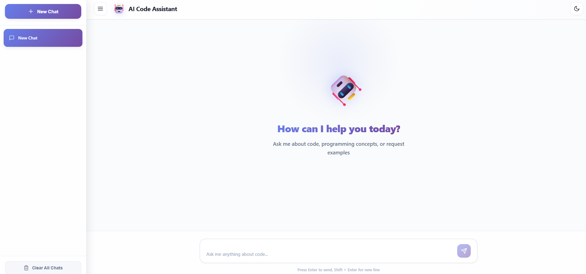

# React Admin Dashboard

A professional, scalable admin dashboard built with modern React ecosystem.

## Features

- 🎨 **Material UI** - Beautiful, responsive design
- 🌓 **Dark/Light Theme** - Toggle between themes
- 📊 **Interactive Charts** - ApexCharts integration
- 🔐 **Role-Based Access** - Admin & Manager roles
- 📋 **Advanced Tables** - Pagination, sorting, filtering
- ⚡ **React Query** - Smart data caching & sync
- 🎯 **Redux Toolkit** - Predictable state management
- 🚀 **Code Splitting** - Lazy loading for performance
- 🔔 **Toast Notifications** - User feedback system
- 🛡️ **Error Boundaries** - Graceful error handling
- 📱 **Responsive** - Mobile-first design

## Tech Stack

- React 18
- Redux Toolkit
- React Query
- React Router v6
- Material UI
- ApexCharts
- Vite

## Getting Started

```bash
# Install dependencies
npm install

# Start development server
npm run dev

# Build for production
npm run build
```

## Default Credentials

**Admin:**
- Email: admin@dashboard.com
- Password: admin123

**Manager:**
- Email: manager@dashboard.com
- Password: manager123

## Architecture Highlights

- Modular feature-based structure
- Custom hooks for reusability
- Optimized bundle splitting
- Centralized API service layer
- Type-safe Redux slices

